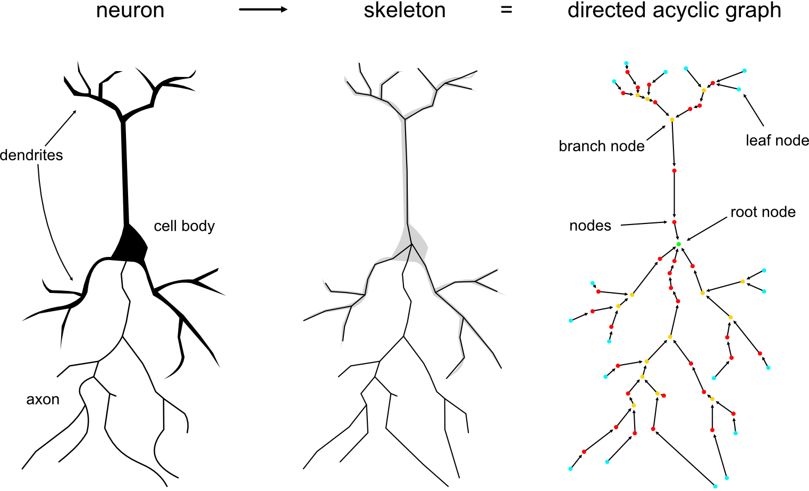
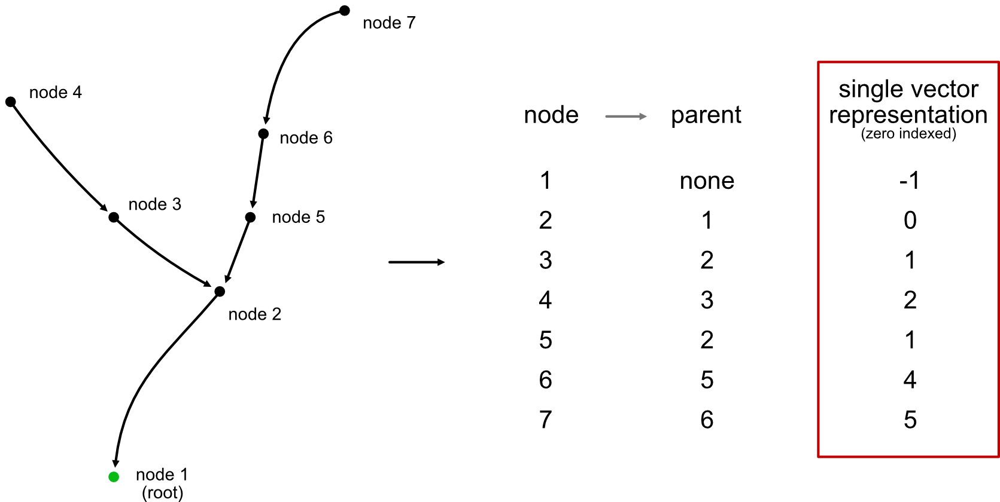
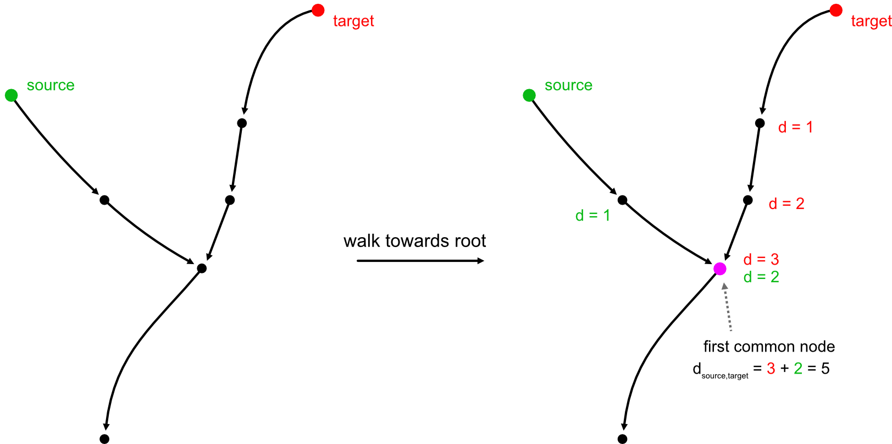

# Operations on Directed Acyclic Graphs

Neurons can be represented as centerline skeletons which themselves can
be treated as trees or "directed acyclic graphs" (DAG) where each node
has *at most* a single parent (root nodes will have no parents).

DAGs have two huge advantages over general graphs:

First, they are super compact and can, at the minimum, be represented by
just a single vector of parent indices (with root nodes having negative
indices).

Second, they are much easier/faster to traverse because we can make
certain assumptions that we can't for general graphs. For example,
we know that there is only ever (at most) a single possible path
between any pair of nodes.

While `networkx` has *some* [DAG-specific functions](https://networkx.org/documentation/stable/reference/algorithms/dag.html) they don't
implement anything related to graph traversal.

## Available functions

The Python bindings for `navis-fastcore` currently cover the following functions:

- [`fastcore.geodesic_matrix`](geodesic.md): calculate geodesic ("along-the-arbor") distances either between all pairs of nodes or between specific sources and targets
- [`fastcore.connected_components`](cc.md): generate the connected components
- [`fastcore.synapse_flow_centrality`](flow.md): calculate synapse flow centrality ([Schneider-Mizell, eLife, 2016](https://elifesciences.org/articles/12059))
- [`fastcore.generate_segments`](segments.md#generate-segments): break the neuron into linear segments
- [`fastcore.segment_coords`](segments.md#segment-coordinates): generate coordinates per lineaer segment (useful for plotting)
