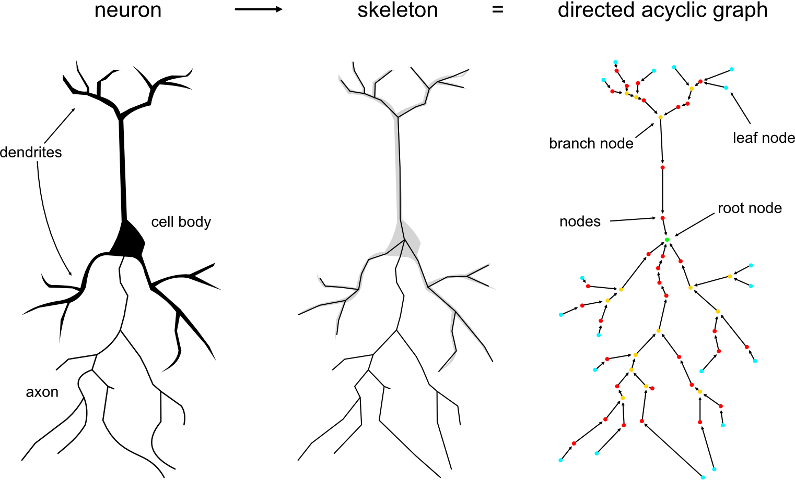
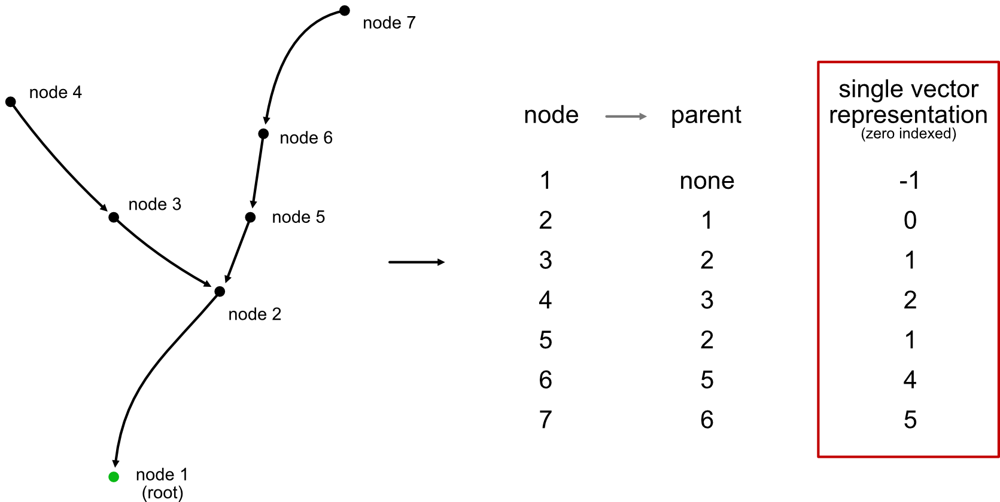
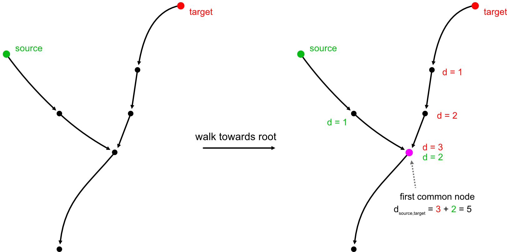

# Operations on Tree Graphs

Neurons can be represented as centerline skeletons which themselves are
rooted trees, a special case of "directed acyclic graphs" (DAG) where each node
has *at most* a single parent (root nodes will have no parents).

Rooted trees have two huge advantages over general graphs:

First, they are super compact and can, at the minimum, be represented by
just a single vector of parent indices (with root nodes having negative
indices).

Second, they are much easier/faster to traverse because we can make
certain assumptions that we can't for general graphs. For example,
we know that there is only ever (at most) a single possible path
between any pair of nodes.

While `networkx` has *some* [DAG-specific functions](https://networkx.org/documentation/stable/reference/algorithms/dag.html) they don't
implement anything related to graph traversal.

## Representing the tree

All three surfaces ultimately hand the core the same thing — a vector of parent
indices — but they differ in how much they do for you:

- **Rust** ([`fastcore::dag`](../rust/index.md)) takes the parent-index vector
  directly, with roots encoded as negative values.
- **Python** ([`navis-fastcore`](../python/index.md)) takes `node_ids` and
  `parent_ids` arrays with arbitrary IDs and maps them to indices internally.
- **R** ([`nat.fastcore`](../r/index.md)) takes a parent-index vector you build
  yourself with `node_indices(ids, parents)`.

See the [capability matrix](../index.md#rooted-trees-skeletons) for which
functions each one exposes.

