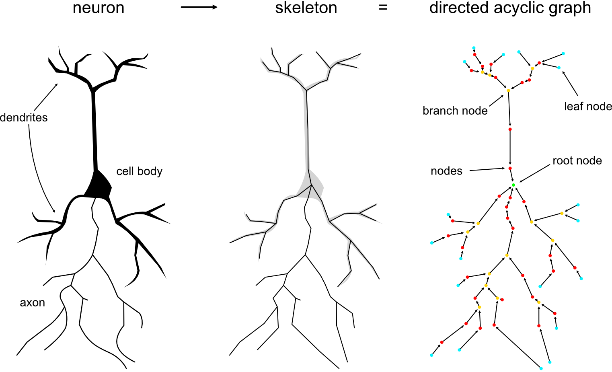
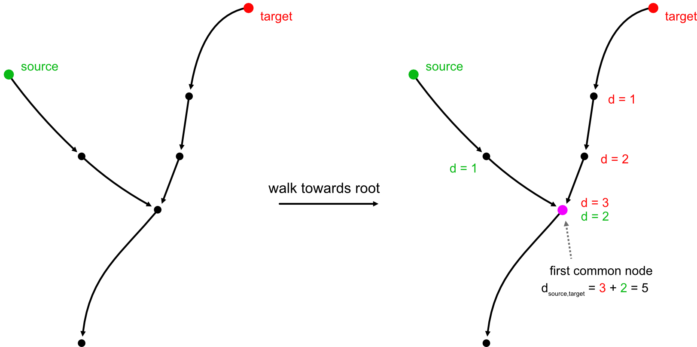

# Operations on Tree Graphs

Neurons can be represented as centerline skeletons which themselves are
rooted trees, a special case of "directed acyclic graphs" (DAG) where each node
has *at most* a single parent (root nodes will have no parents).

Rooted trees have two huge advantages over general graphs:

First, they are super compact and can, at the minimum, be represented by
just a single vector of parent indices (with root nodes having negative
indices).

Second, they are much easier/faster to traverse because we can make
certain assumptions that we can't for general graphs. For example,
we know that there is only ever (at most) a single possible path
between any pair of nodes.

While `networkx` has *some* [DAG-specific functions](https://networkx.org/documentation/stable/reference/algorithms/dag.html) they don't
implement anything related to graph traversal.

## Available functions

The Python bindings for `navis-fastcore` currently cover the following functions:

- [`fastcore.geodesic_matrix`](geodesic.md#navis_fastcore.geodesic_matrix): calculate geodesic ("along-the-arbor") distances either between all pairs of nodes or between specific sources and targets
- [`fastcore.geodesic_pairs`](geodesic.md#navis_fastcore.geodesic_pairs): calculate geodesic ("along-the-arbor") distances between given pairs of nodes
- [`fastcore.connected_components`](cc.md): generate the connected components
- [`fastcore.synapse_flow_centrality`](morphology.md#synapse-flow-centrality): calculate synapse flow centrality ([Schneider-Mizell, eLife, 2016](https://elifesciences.org/articles/12059))
- [`fastcore.break_segments`](segments.md#break-segments): break the neuron into the linear segments connecting leafs, branches and roots
- [`fastcore.generate_segments`](segments.md#generate-segments): same as `break_segments` but maximize segment lengths, i.e. the longest segment will go from the most distal leaf to the root and so on
- [`fastcore.segment_coords`](segments.md#segment-coordinates): generate coordinates per linear segment (useful for plotting)
- [`fastcore.prune_twigs`](morphology.md#prune-twigs): removes terminal twigs below a certain size
- [`fastcore.strahler_index`](morphology.md#strahler-index): calculate Strahler index

